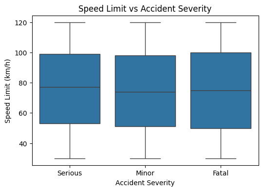
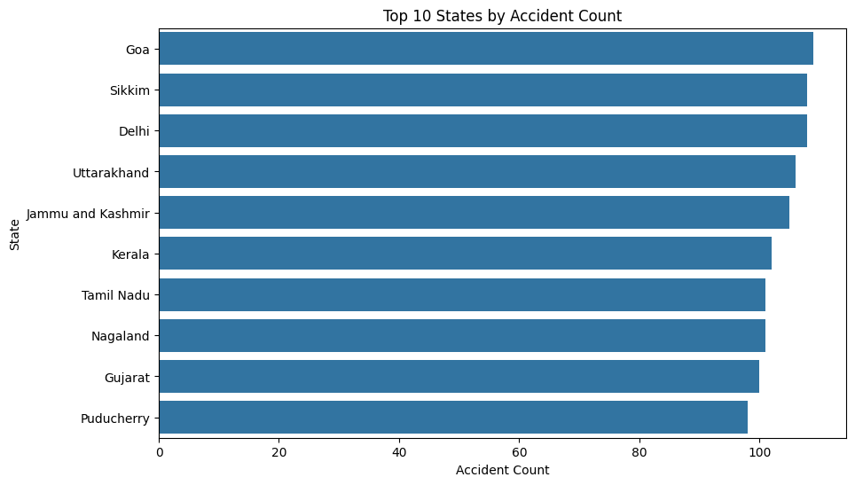
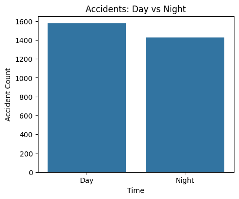
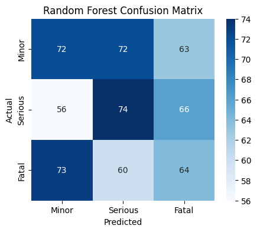

# India Road Accident Analysis Project

**Objective:**  
Analyze 3,000+ Indian road accident records to uncover actionable safety insights and predict accident severity using ML.

---

## **Dataset**
- Source: Ministry of Road Transport & Highways (MoRTH), India
- Records: 3,000 accidents from 2018–2023
- Key columns: State, City, Year, Month, Day of Week, Time of Day, Accident Severity, Number of Vehicles, Vehicle Type, Number of Casualties, Speed Limit, Driver Age, Driver Gender, Alcohol Involvement, Accident Location Details

---

## Project Structure

India_Road_Accidents_Project/
│
├─ data/
│ ├─ raw_accidents.csv # Original dataset
│ └─ final_accidents_ml.csv # Cleaned & feature-engineered dataset
│
├─ notebooks/
│ ├─ 01_load_data.ipynb # Load dataset, inspect data
│ ├─ 02_data_cleaning.ipynb # Handle missing values and fix strings
│ ├─ 03_eda.ipynb # Exploratory data analysis & visualizations
│ ├─ 04_ml_model.ipynb # Train Logistic Regression & Random Forest, evaluate
│ └─ 05_visualizations.ipynb # Save plots to plots/ folder for README
│
├─ plots/ # Generated visualizations

## **Project Workflow**

### 1. Data Loading
- Load CSV into Pandas DataFrame
- Inspect rows, check missing values, and basic statistics

### 2. Data Cleaning
- Handle missing values (Driver Gender, Speed Limit)
- Fix typos and inconsistent strings
- Convert time columns to numeric formats

### 3. Exploratory Data Analysis (EDA)
- Accidents by State/City
- Day vs Night analysis
- Gender-based severity patterns
- Speed vs Severity patterns
- Casualty distributions

---

## **Visualizations**

### **Gender vs Severity**

### **Speed Limit vs Accident Severity**

### **Number of Accidents by State**

### **Day vs Night Accident Count**

### **Random Forest Confusion Matrix**

---

## **4. Feature Engineering**
- `Is_Night` (0=Day, 1=Night)  
- `Severity_Encoded` (0=Minor, 1=Serious, 2=Fatal)  
- Encoded `Driver Gender` numerically  
- Saved final ML-ready dataset: `final_accidents_ml.csv`

---

## **5. Machine Learning**
- **Features used:** `Is_Night`, `Speed Limit`, `Driver Age`, `Driver Gender_Encoded`  
- **Models trained:** Logistic Regression (baseline), Random Forest Classifier  
- **Evaluation:** Classification report, confusion matrix  
- **Insights:**  
  - Night-time and higher speed limits increase accident severity  
  - Driver age and gender influence severity risk  
  - Feature importance from Random Forest highlights actionable safety factors  

---

## **Key Achievements**
- Cleaned and structured 3,000+ Indian road accident records  
- Engineered temporal, severity, and risk features  
- Analyzed night-time and speed-based risk patterns  
- Built data-backed safety insights for policy decisions  
- Trained interpretable ML models to predict accident severity and extract feature importance  

---

## **Future Enhancements**
- Add geospatial analysis (Folium maps for accident hotspots)  
- Include vehicle type, license status, and alcohol involvement as model features  
- Predict accident count by region or hour  
